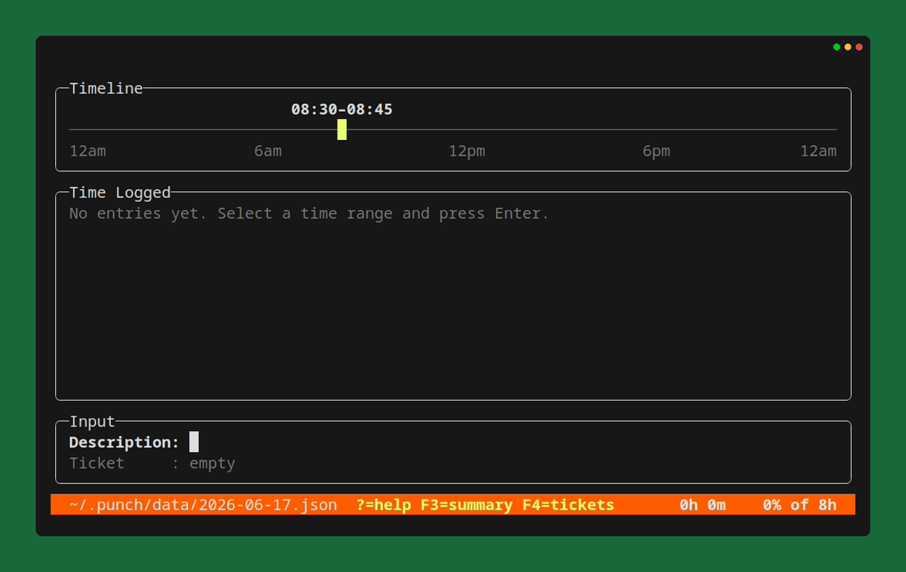

# punch

[](../../actions)
[](https://leglock.github.io/punch/)
[](https://dotnet.microsoft.com/download)
[](../../releases)
[](../../releases)
[](LICENSE)

A TUI time tracker for your workday. Log, label, and export your hours without leaving the terminal.



## Features

- Full-screen terminal UI built with .NET 10 and Spectre.Console
- Day timeline split into 96 quarter-hour slots — select a range and book it
- Label each entry with a description and an optional ticket number
- Pick a ticket from a list (F4) maintained in `~/.punch/tickets.txt`
- Edit and resize existing entries in place
- Running workday total in the status bar, with lunch and break blocks excluded
- Ticket summary view (F3) totalling time per ticket, with billable/unbillable subtotals
- Scrollable time log for busy days
- One JSON file per day, stored under `~/.punch/data/`

## Install

Requires the [.NET 10 SDK](https://dotnet.microsoft.com/download).

```bash
git clone https://github.com/leglock/punch.git
cd punch
dotnet run --project src/Punch.CLI
```

Prebuilt self-contained binaries for Windows and Linux are attached to each [GitHub release](../../releases).

## Usage

```bash
punch                          # Open today
punch --date 2026-05-04        # Open a specific date (yyyy-MM-dd)
punch --version                # Show version information
```

Move the cursor to a start time, resize the selection to cover the span you
worked, type a description (and optionally a ticket), then press Enter to log
the entry. Navigating onto an existing entry selects it for editing or deletion.

## Keybindings

| Key          | Action                              |
|--------------|-------------------------------------|
| Left/Right   | Move cursor / jump between blocks   |
| Up/Down      | Resize selection                    |
| PgUp/PgDn    | Scroll time log                     |
| Enter        | Log time entry                      |
| Tab          | Switch input field                  |
| Ctrl+E       | Edit selected entry                 |
| Ctrl+D       | Delete selected entry               |
| F3           | Ticket summary                      |
| F4           | Pick a ticket for selected entry    |
| ?            | Toggle help                         |
| Ctrl+Q, Q    | Quit                                |

## Data

Entries are saved automatically to `~/.punch/data/yyyy-MM-dd.json` — one file
per day — on every add, edit, and delete.

To populate the ticket picker (F4), maintain a `~/.punch/tickets.txt` file with
one ticket per line as `ticket,title` (tab or comma separated). Blank lines and
lines starting with `#` are ignored.

```
# ~/.punch/tickets.txt
PROJ-123,Fix login redirect
PROJ-456,Quarterly report export
```

To change the daily hours goal used for the status-bar percentage, create a
`~/.punch/settings.json` file. `targetHours` takes a whole number and defaults to
8 when the file is absent.

```json
{
  "targetHours": 6
}
```

## Development

```bash
dotnet build                                              # Build the solution
dotnet test                                               # Run all tests
dotnet test --filter "FullyQualifiedName~PunchStorage"    # Run a subset of tests
```
